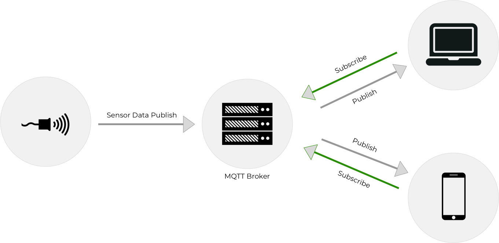

.. MQTT documentation master file, created by
   sphinx-quickstart on Mon Jul  9 16:09:38 2018.
   You can adapt this file completely to your liking, but it should at least
   contain the root `toctree` directive.

Drivers for MQTT Networking
===========================
`These drivers <https://github.com/ForwardLoopLLC/mqtt>`_ support Mosquitto (MQTT) networking. They provide a convenient interface for defining brokers, publishers, and subscribers across multiple different devices with different operating systems and system architectures.

.. toctree::
   :maxdepth: 2
   :caption: Contents:

Overview
========
These drivers run as a set of Docker Compose services: 
    - *broker*: an MQTT broker that uses the configuration defined in **broker.config.mosquitto.conf**
    - *pub*: an optional publish service that publishes data to a broker. This service is defined by the files in the **pub** folder.
    - *sub*: an optional subscribe service that subscribes to topics on the broker. This service is defined by the files in the **sub** folder.

You can define your own publisher and subscriber applications in the **pub** and **sub** folders. The default folders show simple examples of both kinds of service.

You can also change the default port for MQTT communication by defining the operating system variable *MQTT_PORT* before running the drivers.

Prerequisites
=============
You need to `install Docker <https://docs.docker.com/install/>`_ and `Docker Compose <https://docs.docker.com/compose/install/>`_ to use the drivers.

Run the Sample Application
==========================
The drivers come with sample publish and subscribe services defined. You can run the full sample application in order to test the set up and ensure that the drivers are working as expected.

To get started using floop with the MQTT drivers, clone the driver repository:

.. code-block:: bash

    git clone https://github.com/ForwardLoopLLC/mqtt && \
    cd mqtt

To run the sample application, set the *MQTT_PORT* operating system environment variable and bring up the Docker Compose services:

.. code-block:: bash

    export MQTT_PORT=1883 && \
    docker-compose up

You should see the *broker*, *pub*, and *sub* services start up. Since Docker Compose is running in non-detached mode you will see the logging output from the MQTT broker. The *pub* service will publish the Unix epoch timestamp to the broker every 60 seconds on the *test/test* topic and the *sub* service will subscribe to the *test/test* topic to receive that data.

To stop the services, hit `Ctrl-C`.

Modify the Sample Application
=============================
The drivers are designed to be modular so you can change the broker settings and defined publish and subscribe services separately. You must always define publish and subscribe services, even if they are trivial and do not actually perform and publishing or subscription.

Broker Configuration
--------------------
By default, the drivers use **broker/config/mosquitto.conf** as the configuration for the MQTT broker. Additionally, you **must** define the *MQTT_PORT* environment variable. The default port for MQTT communication is 1883. 

For more information on changing the **mosquitto.conf** parameters, see the `Eclipse Documentation <https://mosquitto.org/man/mosquitto-conf-5.html>`_.

Publish Service
---------------
The *pub* service is defined in the **pub** folder.

The **pub** folder must contain at least one file:
    - **Dockerfile**: a Dockerfile that specifies that build environment and dependencies for an application that publishes data to MQTT topics in the broker service. All source files in the **pub** folder are accessible inside of the *pub* service container inside of the folder **/pub**.

While you could write your entire custom *pub* service inside of the **Dockerfile**, you can also specify other files that define an application. For example, the sample application *pub* service calls a Python script that publishes the Unix epoch time as a heartbeat to the MQTT broker every 60 seconds on the *test/test* topic.

Even if you do not plan to use a *pub* service, you still need to define a trivial **pub/Dockerfile**. One such Dockerfile is:

.. code-block:: bash

    FROM busybox:latest

Subscribe Service
-----------------
The *sub* service is defined in the **sub** folder.

The **sub** folder must contain at least one file:
    - **Dockerfile**: a Dockerfile that specifies that build environment and dependencies for an application that subscribes to MQTT topics in the broker service. All source files in the **sub** folder are accessible inside of the *sub* service container inside of the folder **/sub**.

While you could write your entire custom *sub* service inside of the **Dockerfile**, you can also specify other files that define an application. For example, the sample application application *sub* service subscribes to the heartbeat topic on *test/test*.

Even if you do not plan to use a *sub* service, you still need to define a trivial **sub/Dockerfile**. One such Dockerfile is:

.. code-block:: bash

    FROM busybox:latest

Real-World Applications
=======================
See the MQTT drivers in action in real use cases:

`Long-range Temperature Sensor <https://docs.forward-loop.com/gallery/long-range-temperature-sensor/index.html>`_
    Use `Forward Loop Zero <https://forward-loop.com/product.html>`_ to measure the temperature two meters away with two different infrared sensors and pass the data over MQTT in realtime
